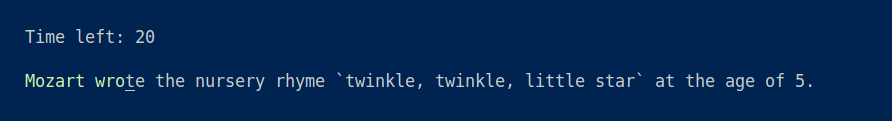

# MyFun - Terminal Typing Simulator ⌨️

A minimalistic typing test application built in Go that challenges you with weird and wonderful facts! Built with the Bubble Tea TUI framework.



## Features ✨

- **Interactive TUI Interface**: Built with [Charmbracelet's Bubble Tea](https://github.com/charmbracelet/bubbletea) for smooth terminal interactions
- **Real-time Feedback**: See your typing accuracy
- **Weird Fact Learning**: Expands your knowledge with random useless facts from [UselessFacts API](https://uselessfacts.jsph.pl)
- **Local Storage**: SQLite database via GORM for:
  - Storing interesting facts for later review
  - Offline mode capability

## Installation 📦

### Prerequisites

- Go
- SQLite3

### Build from Source

```bash
git clone https://github.com/AlexanderKozhevnikov672/MyFun.git
cd MyFun
make download
make run
```
